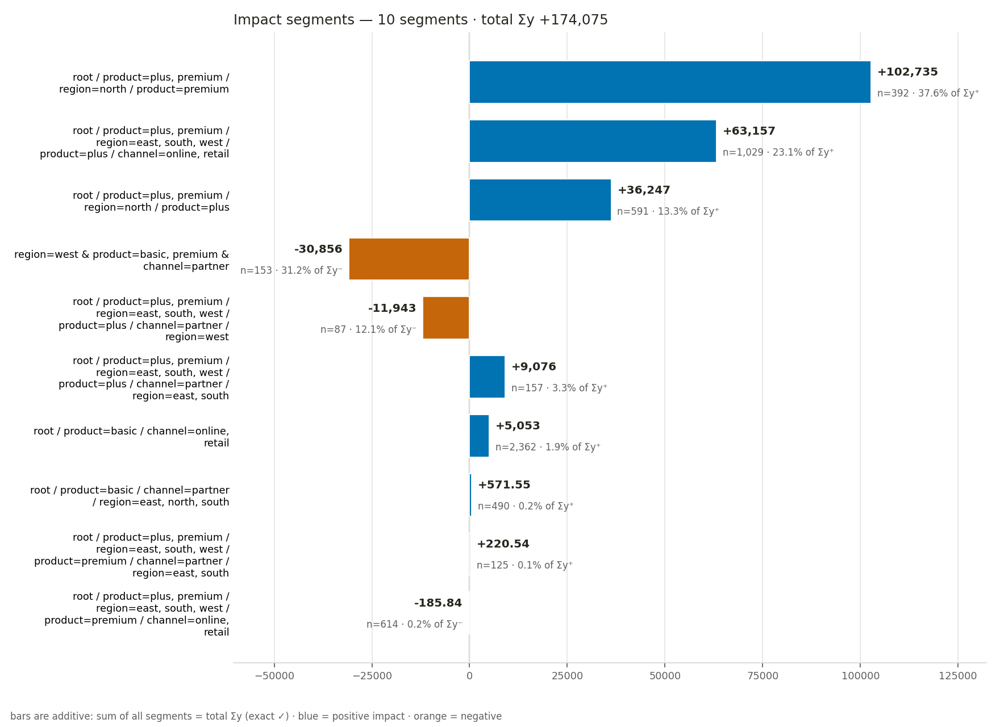
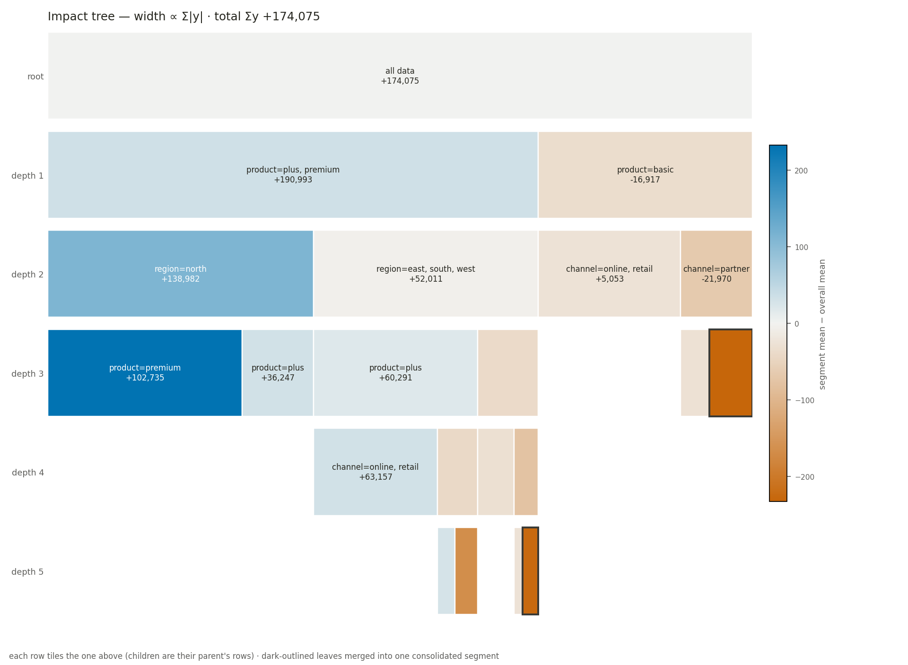
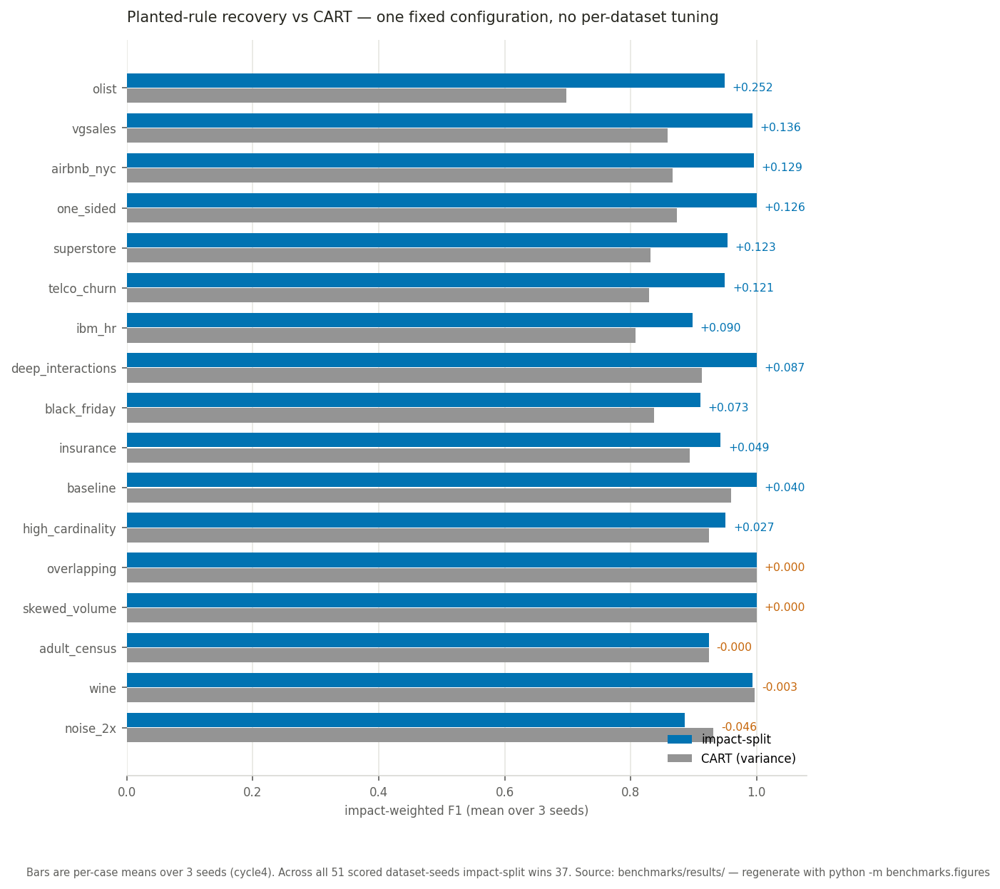
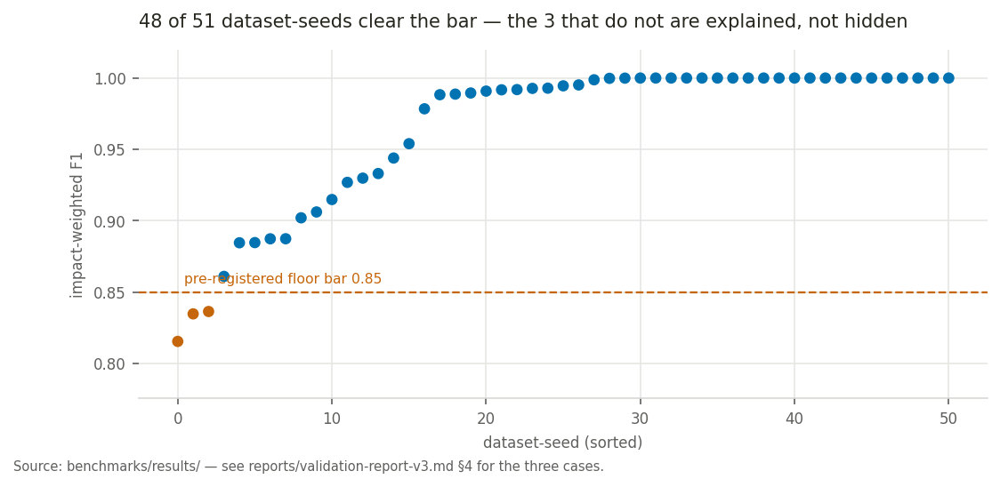

# impact-split

[](https://github.com/euJue07/impact-split/actions/workflows/ci.yml)
[](https://github.com/euJue07/impact-split/blob/main/LICENSE)

<a target="_blank" href="https://cookiecutter-data-science.drivendata.org/">
    
</a>

**Documentation:** [docs/getting-started](https://github.com/euJue07/impact-split/blob/main/docs/docs/getting-started.md) · **Repository:** [github.com/euJue07/impact-split](https://github.com/euJue07/impact-split) · **Issues:** [github.com/euJue07/impact-split/issues](https://github.com/euJue07/impact-split/issues)

Contributions and security reports: [CONTRIBUTING.md](CONTRIBUTING.md) · [SECURITY.md](SECURITY.md)

`impact-split` is an EDA-first tree method that finds the drivers of an **additive KPI** — a quantity whose total is the number you care about (revenue, profit/loss, hours watched, claim amount). The installable package is **`impact_split`** (`from impact_split import ImpactSplitter`).

## The problem it solves

Standard decision trees minimize variance — they isolate segments with similar *average* values. In business work, averages hide what matters most: the total.

A tiny segment with 2 churn events at −$5,000 each looks "purer" than a segment with 10,000 churn events at −$40 each. The variance tree prefers the first. But the second carries 40× the total business weight. `impact-split` optimizes for **additive totals**, so it surfaces the segment that actually moves the KPI.

The rest of this page is the case that the method is both **mathematically sound** and **experimentally tested** — every claim below links to the test or benchmark that backs it.

## See it work

One fit produces everything in this section:

```python
from impact_split import ImpactSplitter

model = ImpactSplitter().fit(X, y)   # X: DataFrame or int-encoded ndarray; y: additive target
print(model)
```

On a 6,000-row synthetic book with two planted drivers (`segment=Enterprise` losing money, `region=West & channel=Online` making it) plus a non-driver numeric column and noise, `print(model)` renders the ledger below — verbatim, generated by [`reports/make_showcase.py`](reports/make_showcase.py), not hand-written:

<!-- BEGIN showcase-summary -->
```
ImpactSplitter — fit summary
============================
rows 6,000 · features 4 · params delta_pct=0.01 noise_z=3.0 max_depth=5 consolidate=True lookahead=True
total Σy -40,431   (Σy⁺ 50,521 · Σy⁻ -90,952)
tree      11 nodes · 6 leaves · depth 3 (interaction order 3)
segments  6 · 2 churn ⇄ · conservation exact ✓

Top segments by |impact|
  #  path                                                                                                    Σy          n        pool share                 gross ⇄
  1  root / segment=Enterprise / channel=Partner, Retail                                                -46,124      1,311      50.7% of Σy⁻                        
  2  root / segment=Mid-Market, SMB / region=West / channel=Online                                      +21,072        372      41.7% of Σy⁺                        
  3  root / segment=Mid-Market, SMB / region=East, North, South                                          -1,553      3,002       1.7% of Σy⁻       +20,575 / -22,128
  4  root / segment=Enterprise / channel=Online / region=East, North, South                             -17,204        494      18.9% of Σy⁻                        
  5  root / segment=Mid-Market, SMB / region=West / channel=Partner, Retail                             +142.29        642       0.3% of Σy⁺         +4,979 / -4,837
  6  root / segment=Enterprise / channel=Online / region=West                                            +3,236        179       6.4% of Σy⁺                        

 ⇄ churn segment: positive and negative flows are both material — the net hides offsetting mass (gross column shows both).
```
<!-- END showcase-summary -->

The two planted drivers land at #1 and #2 with the correct signs. Rows 3 and 5 are **churn** segments — offsetting positive and negative mass the net would hide — and the ledger shows both gross flows.

`model.plot_segments()` renders the same segments as a tornado; `model.plot_tree()` shows where impact concentrates in the tree:





`model.get_impact_segments()` returns the segments as a DataFrame:

| path | total_sum | n_samples | node_id | mean | pool_share |
| --- | --- | --- | --- | --- | --- |
| root / segment=Enterprise / channel=Partner, Retail | -46123.8 | 1311 | node_10 | -35.2 | 0.5 |
| root / segment=Mid-Market, SMB / region=West / channel=Online | 21072.2 | 372 | node_3 | 56.6 | 0.4 |
| root / segment=Enterprise / channel=Online / region=East, North, South | -17204.5 | 494 | node_9 | -34.8 | 0.2 |
| root / segment=Enterprise / channel=Online / region=West | 3235.9 | 179 | node_8 | 18.1 | 0.1 |
| root / segment=Mid-Market, SMB / region=East, North, South | -1553.0 | 3002 | node_5 | -0.5 | 0.0 |
| root / segment=Mid-Market, SMB / region=West / channel=Partner, Retail | 142.3 | 642 | node_4 | 0.2 | 0.0 |

`model.to_html("report.html")` writes a self-contained interactive report (both figures plus a sortable, cross-highlighted segment table) with every asset inlined — no CDN, safe to open offline or email. A rendered example is committed at [`reports/sample-report.html`](reports/sample-report.html).

Finally, `model.ensemble_report(X, y, seed=0)` annotates the same ledger with a forest of perturbed refits — a **stability** score and a 5–95% bootstrap **CI** per segment, plus **shadow drivers** the single tree does not report — without ever changing the tree:

```
Top segments by |impact|
  #  path                                                       Σy          n     pool share      gross ⇄     stability          Σy 5–95%
  1  root / segment=Enterprise / channel=Partner, Retail    -46,124      1,311   50.7% of Σy⁻                    96.0%    [-53,517, -36,480]
  2  root / segment=Mid-Market, SMB / region=West / channel=Online  +21,072        372   41.7% of Σy⁺                   100.0%    [+18,870, +23,185]
  ...
Shadow drivers (material regions the main tree does not report)
  · region=West & segment=Enterprise  Σy≈-9,618 · recurrence 38.0% · via region, segment
```

## How it works

The algorithm builds a ternary tree (Positive / Neutral / Negative) over categorical or pre-binned features. Four ideas do the work; the [derivations page](docs/docs/math.md) proves each, and the section links below go straight to the relevant proof.

**1. Centered-excess routing.** A category routes by how far its sum deviates from the node's expected share, never by raw volume:

```
D_cat = S_cat − n_cat · mean(y_node)
```

On a one-sided KPI (revenue-like, everything positive) every large category has a large raw sum regardless of whether anything interesting happens inside it; centering removes that volume artifact. ([why raw sums fail →](docs/docs/math.md#2-centered-excess--separating-effect-from-volume))

**2. A two-bar local sieve.** A category routes to an outer branch only if its excess clears **both** a materiality bar (a share of node excess volume) and a significance bar (a per-category noise floor):

```
τ_cat = max( V_excess_node · delta_pct ,  noise_z · σ̂ · √n_cat )
```

The significance bar is the category's null band: under pure within-category noise `D_cat` wanders on the scale `σ√n`, so noise alone cannot clear it and deep nodes stop fragmenting when only noise is left. A [pairwise lookahead rescue](docs/docs/math.md#4-multiplicity-correction-on-the-lookahead-rescue) additionally catches XOR-style interactions where every marginal table cancels, and a **churn flag** surfaces offsetting mass no split can separate. ([null-band derivation →](docs/docs/math.md#3-the-two-bar-threshold))

**3. A gain metric that rewards impact, not cardinality.** Among features that clear the sieve, the split score favors large outer-branch totals with few actionable categories:

```
Gain = |S_P| / k_P  +  |S_N| / k_N
```

Dividing by the per-branch category count `k` is what stops a high-cardinality field like Customer ID or ZIP from winning by shattering rows into many tiny slices. ([why divide by k →](docs/docs/math.md#5-the-gain-metric))

**4. A dual-pool stop.** Splitting stops when a branch is globally immaterial for **both** the positive and the negative pool, each graded against its own global total (`V_global_P`, `V_global_N`) rather than a net sum that could let a large positive and a large negative cancel into apparent irrelevance. ([derivation →](docs/docs/math.md#6-the-dual-pool-stop))

After fitting, [post-fit consolidation](docs/docs/math.md#7-consolidation) merges terminal segments that differ on one feature's category set and are statistically indistinguishable, so a single coherent segment is not reported as dozens of identical fragments.

**Derived vs. tuned.** The *forms* above — the `√n` null band, the `1/k` penalty, the `√(2 ln K)` multiplicity correction, the robust MAD scale, the pooled-scale merge test — follow from stated assumptions. The *levels* are not derived: `delta_pct=0.01`, `min_global_impact_pct=0.01`, and `max_depth=5` were fixed empirically by benchmark loops, while `noise_z=3.0` is a conventional significance default rather than a calibrated value — [the math page draws this line explicitly](docs/docs/math.md#9-the-constants-that-were-not-derived). One fixed configuration is used for every dataset — no per-dataset tuning.

## What is guaranteed

These properties are not asserted — they are enforced by the test suite. Each row links its claim to the test that would fail if the claim broke:

| Property | Why it holds | Enforced by |
|---|---|---|
| **Exact sum conservation** | Segments partition the rows; merging disjoint sets sums by definition | `tests/test_viz_data.py::test_payload_conservation_and_counts`, `tests/test_consolidation.py::test_consolidation_preserves_conservation_and_partition`, `tests/test_churn.py::test_gross_flows_conserve_pools_exactly` |
| **Partition disjointness** | Terminal segments are row-disjoint and cover the input | `tests/test_consolidation.py::test_consolidation_preserves_conservation_and_partition`, `tests/test_viz_data.py::test_payload_tree_integrity` |
| **Consolidation is null-safe** | It can only reduce the segment count, never invent a segment | `tests/test_consolidation.py::test_consolidation_is_null_safe`, `tests/test_consolidation.py::test_incompatible_means_are_not_merged` |
| **Noise-floor false-positive control** | Under pure within-category noise `D_cat` cannot clear the `σ√n` significance bar | `tests/test_consolidation.py::test_consolidation_is_null_safe` (2,000 rows of pure Gaussian noise → one root segment; the materiality bar alone would have split, so the `σ√n` bar is what forces abstention), plus the null battery 3/3 (`null_pass_rate` 1.0 in `benchmarks/results/cycle4-synthetic.json`) |
| **Multiplicity-corrected rescue** | The cross-cell bar rises by `√(2 ln K)`, so chance cells cannot pose as interactions | `tests/test_lookahead.py::test_rescue_multiplicity_floor_suppresses_chance_cells`, `tests/test_lookahead.py::test_rescue_ignores_singleton_cells` |
| **Determinism** | A fixed seed reproduces the ensemble report exactly | `tests/test_ensemble.py::test_run_ensemble_deterministic`, `tests/test_ensemble.py::test_fit_replicate_deterministic_and_remappable` |
| **Annotation never mutates the model** | `to_dict()` / `summary()` / plots are byte-identical without a report | `tests/test_viz_data.py::test_payload_has_no_ensemble_key_without_report`, `tests/test_viz_html.py::test_html_unchanged_without_ensemble_and_annotated_with` |
| **Relational input is lossless** | Many-to-one joins are reindex-aligned, so rows cannot duplicate; orphan keys are kept under a sentinel rather than dropped | `tests/test_schema_roundtrip.py::test_normalize_then_flatten_reproduces_the_original_frame`, `tests/test_schema.py::test_flatten_rejects_a_dimension_with_duplicate_keys`, `tests/test_schema.py::test_flatten_keeps_orphan_rows_with_an_unmatched_sentinel`, `tests/test_schema.py::test_flatten_records_unmatched_counts_and_mass_in_provenance` |

## What was measured

`impact-split` is validated on a **planted-rule-recovery** benchmark: an 8-case synthetic battery and 10 semi-synthetic Kaggle datasets, each with known driver rules, run at three seeds — **51 scored dataset-seeds**. The metric is **impact-weighted F1**: per planted rule, the harmonic mean of how much of the rule's total impact the matched segments capture (recall) and how cleanly they isolate it (precision). With one fixed configuration and no per-dataset tuning, the suite holds **mean 0.9646 / floor 0.8154** at the current v0.2.0/v0.3.0 defaults, with exact conservation everywhere and null false-positive control 3/3. (The linked validation report predates the lookahead work and quotes the v0.1.0 headline of 0.962 at the same 0.8154 floor; only the mean has moved since.)

Against a depth-matched CART reference under the same metric, impact-split wins **37 of the 51 dataset-seeds** (6 ties, 8 losses). Averaged per case, the picture is:



The three non-wins are shown, not hidden: `noise_2x` (−0.046, the recorded cost of consolidation under heavy noise), `wine` (−0.003), and `adult_census` (tie). The CART scores were measured at v0.1.0; only impact-split has improved since (synthetic 0.9767 → 0.9836, Kaggle unchanged), so this chart **understates** the current gap.

**The pre-registered floor bar was not met.** The 2026-07 floor loop set a target of floor ≥ 0.85 and reached 0.8154. 48 of 51 dataset-seeds clear 0.85; the three that do not are each explained — overlapping-rule lattices and detectability-edge contrasts — in [`reports/validation-report-v3.md`](reports/validation-report-v3.md) §4. The loop closed on a pre-registered explained-and-accepted exit rather than moving the goalpost.



Reproduce the whole thing from the committed benchmarks:

```bash
python -m benchmarks.run --tag mysynth --cart              # synthetic battery, self-contained
python -m benchmarks.run --tag mykaggle --kaggle --cart    # Kaggle suite, needs kagglehub credentials
python -m benchmarks.figures                               # re-render the charts above
```

Full method, per-case results, and known-weakness analysis: [`reports/validation-report-v3.md`](reports/validation-report-v3.md).

## Quick start

### Install

```bash
pip install impact-split
```

(PyPI, once published — see [CHANGELOG](CHANGELOG.md).) To work on the library itself, use an editable dev install:

```bash
python -m venv .venv
source .venv/bin/activate          # Windows: .venv\Scripts\activate
python -m pip install --upgrade pip
python -m pip install -e ".[dev]"
```

### Constructor knobs and `fit()` options

All optional; defaults shown:

```python
model = ImpactSplitter(
    delta_pct=0.01,          # materiality: share of node excess volume a category must move
    min_global_impact_pct=0.01,
    max_depth=5,             # interaction-order cap (same-feature refinements are free)
    noise_z=3.0,             # significance: per-category noise floor in sigma units
    consolidate=True,        # post-fit merge of statistically-equal sibling segments
    lookahead=True,          # pairwise rescue for XOR-style marginal cancellation
    numeric_binning_strategy="quantiles",  # "quantiles" or "interval"
    numeric_n_bins=10,                     # number of bins for float columns
)
model.fit(X, y, trace=True)  # optional: populate model.fit_trace_ (verbose= is an alias)
```

### Outputs reference

`impact-split` ships five ways to read a fitted model, all built from one JSON-safe payload. Each is also a standalone function (`impact_split.viz.text.render_summary`, `impact_split.viz.static.plot_segments` / `plot_icicle`, `impact_split.viz.html.render_html`) so you can build a custom renderer from `model.to_dict()`.

- **`print(model)` / `model.summary()`** — the text ledger shown above: a header (global pools, split/stop counts) then the top segments by absolute impact.
- **`model.plot_segments()`** — the tornado: one horizontal bar per consolidated segment, blue for positive and orange for negative, diverging from a zero baseline. Churn segments add a hatched band from −Σy⁻ to +Σy⁺ with a net + gross label.
- **`model.plot_tree()`** — the impact icicle: cell width ∝ Σ|y| within its parent, color encoding each node's mean excess, so *where* impact lives and *which direction* it points are visible at once.
- **`model.to_html(path)`** — the self-contained interactive report (offline-safe, no network calls).
- **`model.to_dict()`** — the JSON-safe `meta` / `tree` / `segments` payload behind every renderer.
- **`model.get_impact_segments()`** — the segment DataFrame: `path`, `total_sum`, `n_samples`, `node_id` (or `merged(...)`), `mean`, `pool_share`.
- **`fit(..., trace=True)`** — records one pre-order step per visited node in `model.fit_trace_`, including per-category thresholds, candidate gains, and `stop_reason` (`materiality`, `max_depth`, `identical_rows`, `no_split`).

## Assumptions and limitations

- `fit(X, y)` accepts:
  - `X`: an `np.ndarray` of shape `(n_samples, n_features)` with non-negative integer label-encoded categories, or a `pandas.DataFrame` — float columns are binned via `numeric_binning_strategy` / `numeric_n_bins` (edges stored in `model.numeric_bin_edges_`), other columns are factorized as categorical codes.
  - `y`: an `np.ndarray` or `pandas.Series` of shape `(n_samples,)` with float-coercible **additive** target values.
- `flatten(tables, spec)` additionally accepts a **star or snowflake schema** — one fact
  table at the observation grain plus dimension tables joined many-to-one — and returns the
  flat frame `fit()` expects. The restriction is strict: every join key must be unique and
  non-null in its dimension, and a fan-out join is rejected rather than silently duplicating
  rows. Fact rows whose foreign key does not resolve are kept under an `<unmatched>` category
  (escalating to `<unmatched_1>`, etc. if that literal string already occurs in a joined
  dimension column), so `sum(y)` is preserved exactly. Dimension columns are table-qualified
  (`dim_customer.region`); fact columns keep their names. One-to-many relationships
  (fact → line items) are **not** supported. Each table may be joined at most once, which
  shapes how you spell a **role-playing dimension** — the same `dim_geo` serving both
  `ship_geo` and `bill_geo`. List it under two names in `tables` and join each once:
  ```python
  tables = {"fact": fact, "geo_ship": geo, "geo_bill": geo}  # same object, two keys
  spec = SchemaSpec(fact="fact", target="amount", joins=[
      Join(left="ship_geo", table="geo_ship", right="geo_id", columns=["region"]),
      Join(left="bill_geo", table="geo_bill", right="geo_id", columns=["region"]),
  ])
  ```
  Nothing is copied — both keys reference one DataFrame — and the roles stay distinguishable
  in the output as `geo_ship.region` and `geo_bill.region`.
- For NumPy `X`, discretize continuous features before fitting (label-encode into integer bins).
- Ternary recursion can grow quickly with depth.
- This is an EDA summarization tool, not a cross-validation-first predictive workflow. The three sub-0.85 cases in [`reports/validation-report-v3.md`](reports/validation-report-v3.md) §4 are the known boundaries.

## Learn more

- **The math** — full derivations behind every formula and constant: [`docs/docs/math.md`](docs/docs/math.md). The derivation layer is literature-grounded: every formula's shape carries a citation, and each known approximation states its exact form.
- **The story** — how the algorithm was arrived at, including the refuted variants and the missed floor bar: [`docs/docs/story.md`](docs/docs/story.md)
- **The validation report** — method, per-case results, known weaknesses: [`reports/validation-report-v3.md`](reports/validation-report-v3.md)
- **Worked example notebook** — synthetic DGP with planted effects, fit on observed outcome only: [`notebooks/1.0-jde-impact-split-explainer.ipynb`](notebooks/1.0-jde-impact-split-explainer.ipynb)
- **Real-data trace** — Kaggle Sample Supermarket, step-by-step trace tables: [`notebooks/2.0-jde-supermarket-kaggle-trace.ipynb`](notebooks/2.0-jde-supermarket-kaggle-trace.ipynb) (needs [Kaggle API credentials](https://github.com/Kaggle/kagglehub#authentication))
- **Docs site source** (MkDocs, not yet hosted): build locally per [`docs/README.md`](docs/README.md)
