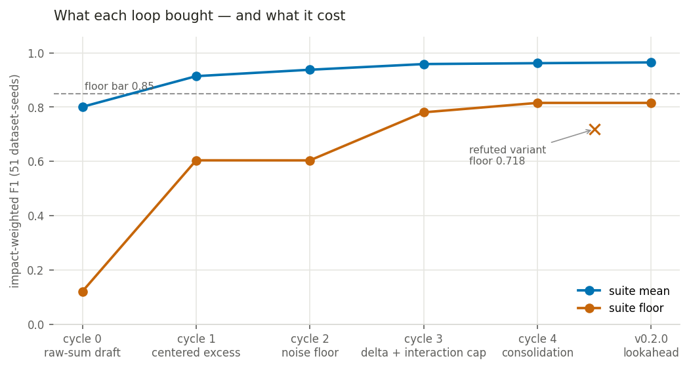

# The story behind impact-split

This page is the narrative layer. The [README](../../README.md) is the argument
and [math.md](math.md) is the derivation; this page is the record of how the
algorithm was actually arrived at — what was tried, what was measured, and what
was thrown away. It is deliberately not a changelog. A changelog lists what
shipped; this page keeps the misses, because the misses are the evidence. A
method that only ever reports its wins has told you nothing about whether to
trust its numbers. The two refuted merge variants, the floor bar that was
pre-registered and then missed, and the ensemble lever that hit a ceiling and
was never built are the strongest reason to believe the numbers that *did*
ship.

---

## 1. The mismatch

Most decision-tree algorithms were designed to minimize variance and isolate
segments whose members share a similar *average* value. That is the right
objective for prediction. It is the wrong objective for business EDA, because
the quantity a stakeholder acts on is almost never an average — it is an
additive total.

The gap shows up the moment the two objectives disagree about which segment
matters. A tiny segment with 2 churn events at -$5,000 each can look "purer"
than a segment with 10,000 churn events at -$40 each. But the second segment
carries far more total business weight. A variance-minimizing splitter will
chase the small pure segment and leave the large one buried inside a catch-all,
because $400{,}000$ of churn spread evenly over 10,000 rows barely moves the
node's variance while two $-\$5{,}000$ outliers move it a lot.

`impact-split` was built to solve this exact mismatch by optimizing for additive
totals rather than average purity. Everything downstream — the routing signal,
the gain metric, the stopping rule — follows from taking that one commitment
seriously. The formal precondition it buys, and where it stops being valid
(intensive KPIs like rates and ratios), is stated in
[math.md §1](math.md#1-notation-and-setting).

---

## 2. Building the four Acts

The method is four decisions stacked in sequence. Each began as a concrete
failure of the naive thing, and each is derived — as a *form*, not a tuned
level — in `math.md`. The framing below (Problem / Evolution / Why it works) is
the reasoning the README used to carry; it lives here now so the README can stay
tight.

### Act I — the local sieve

**Problem.** Forcing every category into a binary good/bad split hides the
baseline, and — worse — on a one-sided KPI (revenue with a positive floor,
claim amounts) it confounds *effect* with *volume*. Every large category has a
large raw sum whether or not anything interesting happens inside it, so a raw
threshold is really a threshold on row count: the tree splits on size and
reports that it found effect.

**Evolution.** Route on the category's deviation from the node's expected share,
not its raw sum:

```math
D_{cat} = S_{cat} - n_{cat}\cdot \bar{y}_{node}
```

On zero-centered targets $\bar{y}_{node}\approx 0$ and this reduces to the raw
sum, so the correction costs nothing where it is not needed. A category then
routes to Positive or Negative only if it clears **both** a materiality bar and
a significance bar:

```math
\tau_{cat} = \max\Big(\underbrace{V^{c}_{node}\cdot\mathrm{delta\_pct}}_{\text{materiality}},\ \underbrace{z\cdot\hat{\sigma}_f\cdot\sqrt{n_{cat}}}_{\text{significance}}\Big)
```

**Why it works.** The materiality bar scales with local volume, so sensitivity
adapts with depth; at 1% of node excess volume it is loose enough that an effect
trapped in a large neutral catch-all is still visible when the pool is
re-entered. The significance bar is the category's null band: under pure
within-category noise a *sum* of $n_{cat}$ residuals wanders like
$\sigma\sqrt{n_{cat}}$, so noise alone cannot clear it and deep nodes stop
fragmenting once only noise is left. The $\sqrt{n}$ scaling, the robust
MAD scale, and the reason `max()` is the conjunction of two necessary conditions
(rather than a sum or a product) are derived in
[math.md §2](math.md#2-centered-excess--separating-effect-from-volume) and
[math.md §3](math.md#3-the-two-bar-threshold).

### Act II — the gain metric

**Problem.** Once categories are routed, the tree still has to choose which
feature to split on. Rewarding raw separated mass hands the split to any
high-cardinality nuisance column — Customer ID, ZIP, transaction ID — which can
put every row in its own category and beat every honest feature.

**Evolution.** Score the *average* separated impact per actionable category, not
the total:

```math
Gain(X_i) = \frac{|S_P|}{k_P} + \frac{|S_N|}{k_N}
```

**Why it works.** The undivided criterion's supremum is attained by pure
shattering, so an ID column would always win; dividing by the per-branch
category counts $k_P, k_N$ turns each branch's score into a mean, and a column
that spreads the same mass over 25 categories scores $1/25$ of one that isolates
it in a single actionable slice. It is not a tuned regulariser — the penalty is
a direct consequence of scoring the average. The full argument, including which
of the two defenses (the sieve vs. the $1/k$ term) binds at which node size, is
[math.md §5](math.md#5-the-gain-metric).

### Act III — the dual-pool stop

**Problem.** Local thresholds shrink with depth, so eventually noise looks
material. Standard stopping rules (max depth, min samples) are not tied to
financial materiality, and a single *net* stop rule discards exactly the node
worth investigating — a node holding $+8\%$ and $-8\%$ of all impact nets to
zero and looks immaterial, while actually containing 16% of the dataset's
impact.

**Evolution.** Grade a node's gross positive and negative flows against separate
global pools, and continue if **either** clears the bar:

```math
V_{global\_P} = \sum_{y_i>0} y_i, \qquad V_{global\_N} = \sum_{y_i<0}|y_i|
```

**Why it works.** Two pools with two denominators make the stop immune to
cancellation — offsetting mass can never net itself out of existence — and a
loss-side node is graded against the loss book it belongs to rather than against
a combined total that would swamp it. This is
[math.md §6](math.md#6-the-dual-pool-stop); the same two-pool logic reappears at
the reporting layer as the churn flag (§5 below).

### Act IV — consolidation

**Problem.** The tree can only cut, never regroup. When it splits on one
segment's features, any *other* coherent segment is tiled across the resulting
branches into dozens of fragments that all behave identically — and the readable
answer, a union of at most three segments, cannot reassemble them. (This Act was
added by the floor loop; §4 is its origin story.)

**Evolution.** After fitting, iteratively merge terminal segments that (a) differ
on exactly one feature's category set — so the union stays a single readable
conjunction — and (b) have statistically compatible means:

```math
|\bar{y}_1 - \bar{y}_2| \le z\cdot\hat{\sigma}\cdot\sqrt{\tfrac{1}{n_1}+\tfrac{1}{n_2}}
```

**Why it works.** The $\sqrt{1/n_1+1/n_2}$ is the standard error of a difference
of independent means, and $z$ is the same `noise_z` as the sieve — so a
difference too small for the splitter to have acted on is also too small to keep
two segments apart. The tree is untouched (plots and traces keep the full
structure), merging disjoint row sets preserves sum conservation by
construction, and the pass is null-safe: it can only reduce the segment count.
The one honest cost — it merges on *failure to reject* equal means, which is not
proof of equality — is stated in [math.md §7](math.md#7-consolidation).

---

## 3. The robustness loop (2026-07-14)

The first loop had a pre-registered bar: mean impact-F1 $\ge 0.9$ across the full
suite **and** no dataset below 0.7, under one fixed configuration with no
per-dataset tuning. The starting point was not close. Over the 51 scored
dataset-seeds the baseline formula scored **0.8009 mean / 0.1208 floor** — the
floor being `adult_census/42`, a one-sided KPI where the method fell apart.

The autopsy was unambiguous and it indicted a design choice, not a bug. With an
all-positive base, the raw $\delta$ sieve always found the *big* categories over
the 5%-of-volume threshold, so the tree split on volume and the centered-excess
fallback that would have seen through the base never fired. The fix was not to
make centered routing an option — it was to **remove raw-sum routing outright**
and make centered excess the only routing signal. Raw and centered agree exactly
on a zero-centered target, so nothing was lost where the base was already zero,
and the volume artifact vanished where it wasn't. That single change moved the
suite to **0.9139 / 0.6039**.

The next dominant failure was fragmentation deep in the tree: 5% of a small
node's excess volume sits below the noise band, so noise categories kept
routing (IBM HR grew 74 leaves on 1,470 rows). The answer was the per-category
noise floor — the $z\cdot\hat{\sigma}_f\cdot\sqrt{n_{cat}}$ significance bar —
which under a within-category-noise null stops noise routing without touching
real effects (**0.9376 / 0.6036**, IBM HR down to 31 leaves). A final rebalance
— dropping `delta_pct` to 1% now that the noise floor carried the significance
duty, plus capping *interaction order* rather than physical depth so 3-way rules
get separated before `max_depth` runs out — brought the suite to
**0.9585 / 0.7806**, i.e. **0.959 / 0.781**. The bar was met at cycle 3; no
auto-tuner was needed and the sacred defaults were untouched.

---

## 4. The floor loop (2026-07-15)

Meeting a floor of 0.7 left five dataset-seeds sitting below 0.85, and the second
loop pre-registered a harder bar to chase them: **floor $\ge 0.85$**, mean
$\ge 0.955$, defaults-or-auto-tuner only. This is the loop that did not fully
succeed, and that is the point of recording it in detail.

Phase 0 ran a **27-config hyperparameter sweep** (`delta_pct` × `noise_z` ×
`max_depth`) across the five floor cases and ruled hyperparameter tuning *out*:
the best configuration in the entire grid reached a floor-case minimum of only
**0.806**, still short of 0.85, and `max_depth` moved it by $\pm 0.003$. The
same Phase-0 pass located the real mechanism with an uncapped-union diagnostic:
**21 of the 25 floor-case rules were already being found** at uncapped F1
**0.87–1.00** with precision $\approx 1.0$ — the tree had the mass in clean
leaves — but scattered past the 3-segment union cap. The deficit was structural,
not a level: **the splitter could cut but never regroup.** That diagnosis is what
motivated Act IV.

Consolidation shipped and moved the suite to **0.9617 / 0.8154**, i.e.
**0.962 / 0.815**, with mean terminal segments down **26%** — a strict readability
win on top of the score. `olist/42` went from 0.815 to 0.915 as 19 fragments
collapsed into one conjunction.



| cycle | what changed | mean | floor |
| --- | --- | --- | --- |
| 0 | baseline (raw-sum routing) | 0.8009 | 0.1208 |
| 1 | centered excess as the only routing signal | 0.9139 | 0.6039 |
| 2 | per-category noise floor | 0.9376 | 0.6036 |
| 3 | `delta_pct`→0.01 + interaction-order cap | 0.9585 | 0.7806 |
| 4 | post-fit consolidation (shipped) | 0.9617 | 0.8154 |
| 5 | *relaxed-merge variant — refuted, reverted* | 0.9445 | 0.7184 |
| — | + v0.2.0 lookahead (current default) | 0.9646 | 0.8154 |

**The pre-registered $\ge 0.85$ floor bar was missed: floor 0.8154.** It is not
rounded up and it is not narrated away. What actually happened is that **48 of the
51 dataset-seeds clear 0.85** and the loop closed on its pre-registered
*explained-and-accepted* exit for the remaining three, each with a fully
diagnosed mechanism at an honest statistical limit:

- **ibm_hr/7 (0.815)** — overlapping planted rules tile the data into lattice
  cells with real 2–3σ pairwise differences; the truthful partition needs 5–7
  segments and the $\le 3$-union under-credits it (uncapped 0.88–1.00). Merging
  those cells would be factually wrong. A metric-boundary case, not a formula
  defect.
- **insurance/42 (0.836)** — the planted smoker×sex contrast is ~0.7σ, at the
  detectability edge even with oracle noise knowledge, on n=1.3k.
- **black_friday/2026 (0.835)** — a 1.9%-support order-3 rule is root-shattered
  by two 10%-support rules; even the uncapped union reaches only 0.736, and no
  configuration in the sweep recovers it.

Before that exit, two ways of relaxing the merge criterion were tried to push the
floor further, and **both were refuted on guard evidence and kept as negative
results** — they are not deleted, because a reader deserves to know the merge
rule was pushed until it broke:

1. **Globally-immaterial distinction merging** — also merge when the misattributed
   mass is below 1% of global excess volume. This is the cycle-5 dip in the chart.
   It broke the synthetic baseline **1.000 → 0.883** (and adult_census, airbnb);
   the autopsy showed a wrong baseline merge and a desired IBM HR merge both sit
   within 5% of any global floor. **There is no separating margin** between good
   and bad merges at any threshold with this statistic.
2. **The equivalence margin** ($|\Delta m|\le 0.1\hat{\sigma}$) — inert. Floor
   cases were identical to four decimals; the sub-band contrasts it would rescue
   are never split apart in the first place. **The dead zone it would rescue is
   empirically empty.**

The full record is in
[reports/validation-report-v3.md](../../reports/validation-report-v3.md) §§3–4 and
[reports/floor-diagnosis.md](../../reports/floor-diagnosis.md).

---

## 5. v0.2.0 — the cancellation blind spot

The floor loop closed a *scatter* problem; v0.2.0 closed a *cancellation* one.
When the sign of $y$ depends on a combination of features — an XOR-style
interaction — every marginal category table nets to ~0. Each feature, examined
on its own, looks like noise. In v0.1.0 that node silently leafed out with
`stop_reason="no_split"`, so a genuinely material region reported as a single
near-zero segment: **+10,000 and −9,999 collapsed into one ~0 leaf.** The mass
was real and both-signed; the sieve simply could not see it one feature at a
time.

The pairwise lookahead rescue re-runs the same two-bar sieve over the *crossed*
categories of a feature pair, with the significance bar multiplicity-corrected
($z_{eff} = \mathrm{noise\_z}+\sqrt{2\ln K}$, derived in
[math.md §4](math.md#4-multiplicity-correction-on-the-lookahead-rescue)) so a
wide fishing expedition pays for its many looks while an honest 2×2 XOR barely
does. The discipline that matters: **it fires only at that exact signature** —
materiality triggered, best marginal gain zero, interaction cap not reached — so
every happy-path fit is byte-identical to the pre-rescue baseline, verified
across the full Kaggle suite. No general fit got quietly perturbed to buy one
special case.

What lookahead cannot reach, the **churn flag** refuses to hide. Offsetting mass
that no split can separate — identical feature rows carrying $\pm y$, or a
higher-order interaction — is surfaced rather than netted to zero: a segment
whose positive *and* negative gross flows each clear the materiality bar is
marked `is_churn` and every renderer shows both flows
(`net +1 (gross +10,000 / −9,999)`). The honest residual is stated rather than
papered over: **3-way-and-higher cancellation whose every pairwise margin also
cancels is still out of reach.** The rescue is pairwise; a purely 3-way XOR gets
flagged as churn, not resolved into its drivers.

---

## 6. v0.3.0 — measuring the ledger instead of replacing it

v0.3.0 asked a different kind of question: can a Random-Forest-style ensemble
*improve* the single tree? The deliberate answer was to **annotate, never
average.** `ensemble_report()` fits a forest of perturbed refits that measures
the one fitted tree — bootstrap replicates give each segment a stability score
and a bootstrap CI, feature-subsampled replicates surface shadow segments — and
there is no prediction averaging anywhere in the module. The greedy tree stays
the answer.

That restraint was earned by measurement, and it produced two negative results
that belong here as results, not as absences:

- **Stability filtering changed nothing.** Scoring stability-filtered ledgers
  against the synthetic battery moved the mean impact-F1 from **0.9836 to 0.9835**
  and left the floor **flat at 0.8846 across every stability threshold**. No
  default changed, because there was no gain to bank.
- **Shadow promotion hit an oracle ceiling.** Before designing any promotion
  rule, Phase 0 measured the best case: score the battery with *all* accepted
  shadows added as extra candidates. Across six configurations the low-overlap
  mean delta ranged from **−0.0109 to 0.0000** and never reached the
  pre-registered +0.003 gate; the clean, crowding-free configuration showed
  **exactly zero gain** (part-mean 0.9836, matching the published baseline to the
  digit). On the floor case the union used *none* of the 7–10 shadows it
  surfaced — the lost mass is statistical dilution inside broad segments, not a
  masking failure a shadow could recover. So shadow promotion **cannot beat the
  battery, and it was never built.** The verdict is recorded in
  [reports/cycle-log.md](../../reports/cycle-log.md) (Loop 3) so it is not
  re-attempted from scratch.

(The 0.9836 / 0.8846 figures here are the synthetic-battery numbers the ensemble
diagnostics are scored against — a stricter arena than the full-suite
0.9646 / 0.8154, and the right one for asking whether the ensemble adds anything.)

---

## 7. What the discipline bought

Read end to end, the record is deliberately unflattering in places, and that is
the argument. Three habits held throughout:

- **Pre-registered bars were honored even when missed.** The floor loop set
  $\ge 0.85$, reached 0.8154, and said so — closing on a pre-registered
  explained-and-accepted exit rather than moving the goalpost or rounding the
  number. A bar you are willing to fail is the only kind that certifies the bars
  you pass.
- **Held-out gates stayed held out.** One fixed configuration scored every
  dataset with no per-dataset tuning; the Kaggle suite was kept as a
  no-regression gate rather than a surface to optimize against. That is what
  makes the shipped defaults defaults instead of a fit to the benchmark.
- **Negative results were kept, not deleted.** Two refuted merge variants, an
  inert equivalence margin, a flat stability filter, and a shadow lever that hit
  a ceiling all live in the repository. They cost nothing to keep and they are
  the record that the shipped formula was pushed until it pushed back — which is
  the difference between a number you can quote and a number you can trust.

For the derivations that back the formulas, see [math.md](math.md); for the
per-case scores, the sweep, and the known-weakness analysis, see
[reports/validation-report-v3.md](../../reports/validation-report-v3.md).
